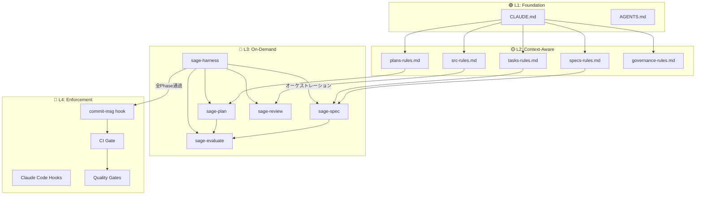
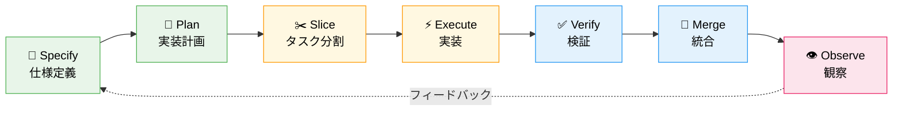
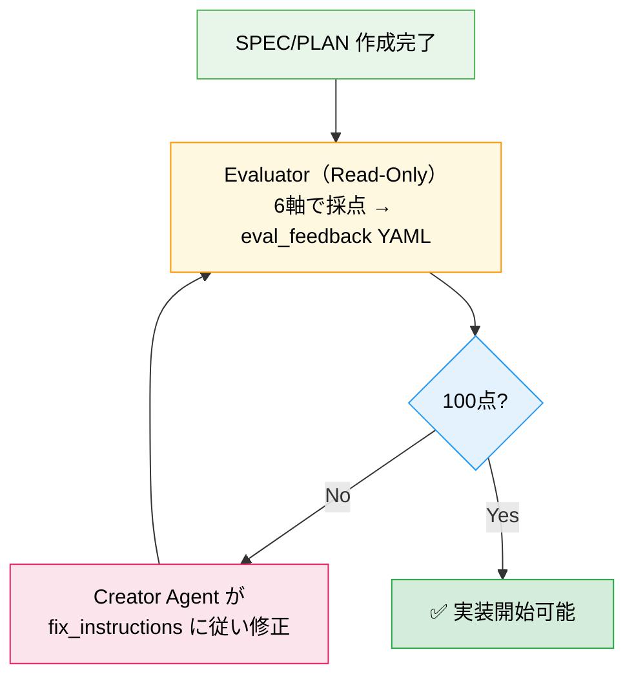
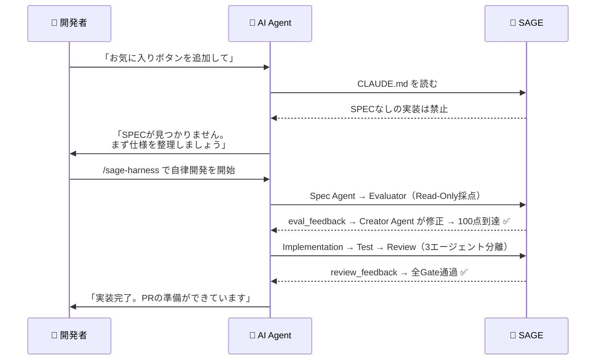
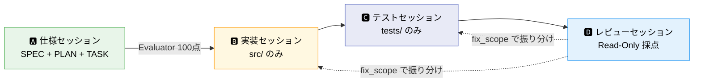
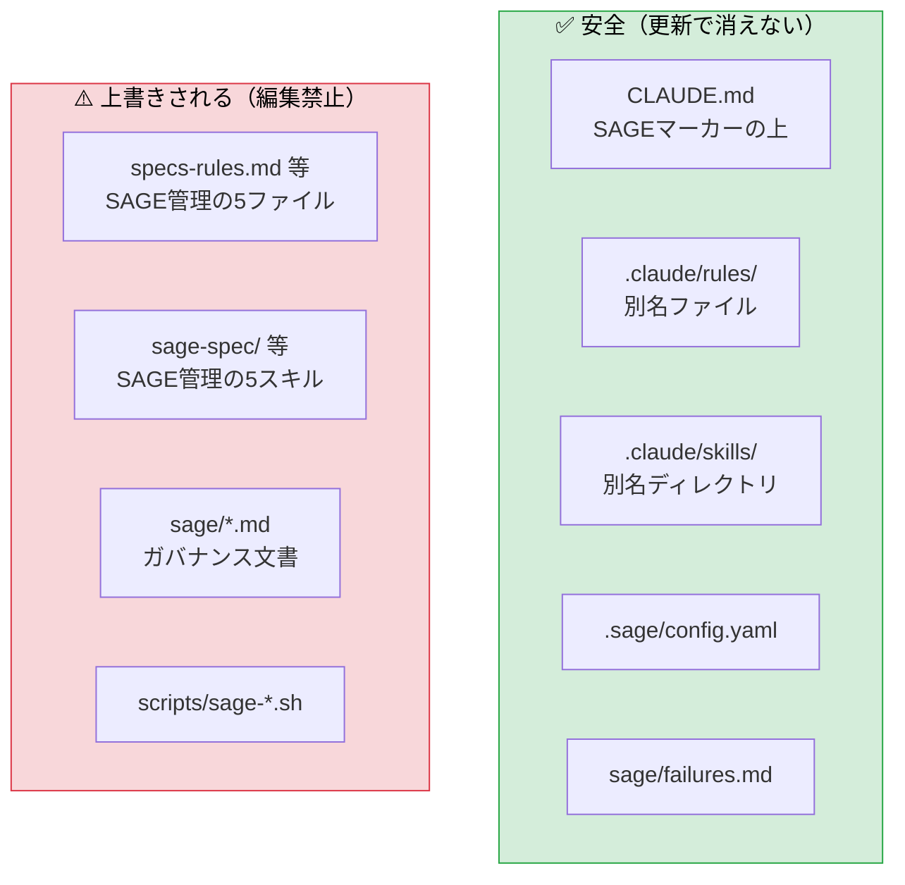
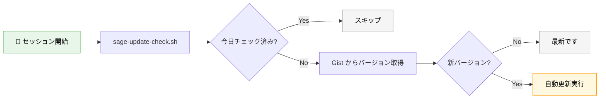
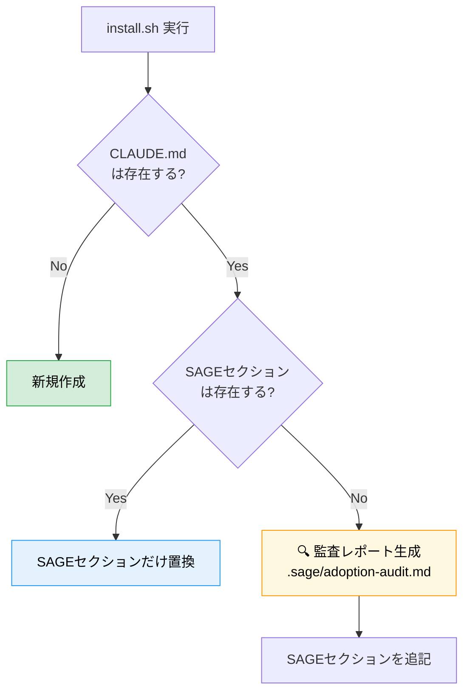
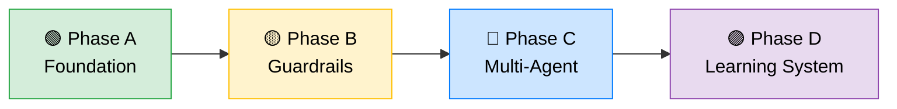

# SAGE Development System

> **S**pec-driven, **A**gent-governed, **G**uard-railed, **E**volving

複数のAIエージェントが同時にコードを書く環境で、**人間の規律に頼らずアーキテクチャで品質を保証する**開発体系。

---

## なぜ SAGE が必要か

従来の「人間がレビューで品質を守る」方式は、AIエージェントの並列開発では機能しない。

```
❌ 従来：人間の規律 → レビューが追いつかない → 品質崩壊
✅ SAGE：構造が強制 → AIが勝手に守る → 品質維持
```

SAGEは「AIにうまくコードを書かせるテクニック集」ではない。
**AIが逸脱しにくい構造を先に作る技術**。

---

## アーキテクチャ全体図



### 4層ガードレール構造

| 層 | 名前 | 役割 | いつ動くか |
|----|------|------|-----------|
| 🟢 **L1** | **Foundation** | CLAUDE.md / AGENTS.md。AIが最初に読む「憲法」 | **毎セッション自動** |
| 🟡 **L2** | **Context-Aware** | `.claude/rules/`。パス別の詳細ルール | **該当ファイル操作時のみ** |
| 🔵 **L3** | **On-Demand** | `.claude/skills/`。ワークフロー + 自動採点 + ハーネス | **`/sage-spec` `/sage-harness` 等で呼んだ時のみ** |
| 🔴 **L4** | **Enforcement** | Claude Code hooks + commit-msg hook + CI Gate + Quality Gates | **セッション中＋コミット・PR時に機械強制** |

---

## 開発ライフサイクル



### 採点・修正ループ（Evaluator Read-Only + Creator Agent 修正）

`/sage-harness` がオーケストレーターとして、Evaluator（採点のみ）と Creator Agent（修正のみ）を分離制御する。**同一エージェントが採点と修正を兼務しない**。



| 軸 | 満点 | 何を見るか |
|----|------|-----------|
| ① Codified Rules | **20点** | CLAUDE.md連携・Forbidden Shortcuts・機械的ゲート |
| ② Atomic Decomposition | **20点** | タスク独立性・依存グラフ・完了条件 |
| ③ Spec-Driven Development | **20点** | SPEC-ID・受け入れ条件・エラーケース |
| ④ Observable Development | **20点** | 検証コマンド・テスト種別・フィードバック |
| ⑤ Knowledge Management | **15点** | failures.md連携・Error Resolution |
| ⑥ 段階採用戦略 | **5点** | 影響ゼロ設計・ロールバック手順 |

| スコア | グレード | 判定 |
|--------|---------|------|
| **100** | 🏆 S++ | 完璧。即実装可 |
| 95-99 | ⭐ S+ | ほぼ完成。微修正で到達可能 |
| 90-94 | ✨ S | 優秀。小改善あり |
| 85-89 | 🔹 A- | 良好。改善推奨 |
| 70-84 | 🔸 B | 基本OK。要改善 |
| ~69 | ⚠️ C | 大幅改善必要 |

---

## 導入方法

### Step 1: install.sh を取得して実行する

```bash
cd /path/to/your-project
curl -fsSL https://gist.githubusercontent.com/YOUR_USER/GIST_ID/raw/install.sh | bash
```

または `install.sh` を直接ダウンロードして実行:

```bash
bash install.sh
```

### Step 2: 完了

これだけです。以下が自動セットアップされます：

```
your-project/
├── 🟢 CLAUDE.md              ← AI が毎セッション自動で読む
├── 🟢 AGENTS.md              ← Codex が自動で読む
├── 🟡 .claude/rules/         ← パス別ルール（5ファイル）
├── 🔵 .claude/skills/        ← ワークフロー（4スキル）
├── 📝 specs/                 ← SPEC テンプレート
├── 📐 plans/                 ← PLAN テンプレート
├── ✂️  tasks/                 ← TASK テンプレート
├── 📜 sage/                  ← ガバナンス文書
├── 📜 templates/hooks/     ← Claude Code hooks（5スクリプト）
├── 🔴 .git/hooks/commit-msg  ← TASK-ID 強制
├── ⚙️  .sage/install-state.yaml ← インストール状態記録
└── ⚙️  scripts/               ← ID生成・検証
```

### Step 3: 普通に開発を始める



---

## AIエージェントでの運用

### セッション分離（必須）



| セッション | 役割 | 使うスキル | Write権限 | 禁止事項 |
|-----------|------|-----------|----------|---------|
| 🅰️ **仕様** | SPEC・PLAN・TASKを作る | `/sage-spec` `/sage-plan` | specs/, plans/, tasks/ | コードを書かない |
| 🅱️ **実装** | TASKのFile Scopeに従って実装 | — | src/（File Scope内） | tests/, specs/ を触らない |
| 🅲️ **テスト** | テストを作成・修正 | — | tests/ | src/ を修正しない |
| 🅳️ **レビュー** | 6軸100点で採点 + Gate実行 | `/sage-review` | NONE | コードを一切修正しない |

> **鉄則**: 同じセッションで実装とレビューを行わない。`/sage-harness` はこの分離を自動で制御する

---

## 核心思想

| # | 原則 | 説明 |
|---|------|------|
| 1 | 📝 **仕様が最上位の真実** | コードは成果物であり、真実ではない |
| 2 | 🤖 **AIは制約内の実行者** | 仕様・役割・権限・制約・検証の中で働く |
| 3 | ✅ **品質は検証から生まれる** | モデルの優秀さではなく、構造と検証の強さ |
| 4 | ✂️ **並列化は分割設計** | AIを増やすのではなく、責務を分けて粒度を整える |
| 5 | 👤 **人間は監督者** | 目的定義・仕様承認・優先順位・例外判断・最終責任 |

---

## ディレクトリ構成

```
.
├── 🟢 CLAUDE.md                    # 最小ブートストラップ（~20行）
├── 🟢 AGENTS.md                    # Codex向けルール
│
├── 🟡 .claude/
│   ├── rules/                      # パス別ルール（自動ロード）
│   │   ├── specs-rules.md          # specs/** 操作時
│   │   ├── plans-rules.md          # plans/** 操作時
│   │   ├── tasks-rules.md          # tasks/** 操作時
│   │   ├── src-rules.md            # src/** app/** 操作時
│   │   └── sage-governance-rules.md # sage/** 操作時
│   │
│   └── skills/                     # オンデマンドワークフロー
│       ├── 🔵 sage-spec/           # /sage-spec → SPEC作成
│       ├── 🔵 sage-plan/           # /sage-plan → PLAN+TASK作成
│       ├── 🔵 sage-review/         # /sage-review → コードレビュー（6軸100点）
│       │   └── references/         # コードレビュー採点基準
│       ├── 🔵 sage-evaluate/       # /sage-evaluate → SPEC/PLAN採点（Read-Only）
│       │   └── references/         # SPEC/PLAN採点基準・知識ベース
│       └── 🔵 sage-harness/        # /sage-harness → 自律開発オーケストレーター
│
├── 📜 templates/                    # テンプレート・フック
│   └── 📜 hooks/                   # Claude Code hooks（5スクリプト）
│
├── 📝 specs/                       # SPEC-XXXX 仕様書
├── 📐 plans/                       # PLAN-XXXX 実装計画
├── ✂️  tasks/                       # TASK-XXXX タスク定義
├── 📜 sage/                        # ガバナンス文書（人間の承認が必要）
├── ⚙️  scripts/                     # ID生成・検証・公開スクリプト
│   ├── sage-doctor.sh              # SAGE健全性チェック
│   ├── sage-repair.sh              # ファイル修復
│   └── sage-report.sh              # 採用メトリクス
├── 🔴 .git/hooks/                  # commit-msg hook（TASK-ID強制）
├── 🔧 .sage/                       # ランタイム設定・実行ログ
│   ├── install-state.yaml          # インストール状態記録
│   └── metrics/                    # 採用メトリクスデータ
└── 🔴 .github/                     # CI/CDワークフロー
```

---

## カスタマイズと更新の共存



| やりたいこと | やり方 | 更新時 |
|:------------|:-------|:------:|
| プロジェクト固有ルールを追加 | CLAUDE.md のSAGEマーカーより**上**に書く | ✅ 安全 |
| パス別ルールを追加 | `.claude/rules/` に**別名で**ファイル作成 | ✅ 安全 |
| スキルを追加 | `.claude/skills/` に**別名で**ディレクトリ作成 | ✅ 安全 |
| SAGE管理ファイルを直接編集 | **やらない** | ❌ 消える |

---

## 更新方法

### 自動更新（推奨）

`.sage/config.yaml` に `installer_url` を設定するだけ：

```yaml
auto_update:
  installer_url: "https://gist.githubusercontent.com/YOUR_USER/GIST_ID/raw/install.sh"
```



### 手動更新

```bash
bash install.sh
```

---

## 既存 CLAUDE.md がある場合

初回導入時に既存ルールを自動監査します。



### 監査レポートの3区分

| 区分 | 意味 | 対応 |
|:-----|:-----|:-----|
| ✅ **SAFE_AUTO_APPLY** | SAGEと無関係 | 何もしなくてOK |
| 🟡 **NEEDS_REVIEW** | SAGEと重複の可能性 | 手動で確認、重複を削除 |
| 🔴 **CONFLICT** | SAGEと矛盾の可能性 | **手動で解決が必要** |

---

## テンプレート管理者向け

Gist 設定・バージョン公開・リリースフローについては [docs/maintainer-guide.md](docs/maintainer-guide.md) を参照。

---

## 導入フェーズ

`install.sh` は Phase A を自動セットアップします。



| Phase | 内容 | 状態 |
|-------|------|:----:|
| 🟢 **A: Foundation** | 仕様テンプレ・タスクテンプレ・基本CI・境界定義 | ✅ 自動 |
| 🟡 **B: Guardrails** | architecture check・security scan・レビュールール・hooks profile設定 | 📋 手動 |
| 🔵 **C: Multi-Agent** | 実装/テスト/レビューAI 3分離・`/sage-harness` 自律ループ・doctor/repair/report | 📋 手動 |
| 🟣 **D: Learning System** | 実行履歴分析・失敗パターン蓄積・テンプレ改善 | 📋 手動 |

詳細は [sage/adoption-phases.md](sage/adoption-phases.md) を参照。

---

## よく使うコマンド

```bash
# SPEC-ID を発行
bash scripts/sage-id-gen.sh spec

# PLAN-ID を発行
bash scripts/sage-id-gen.sh plan

# TASK-ID を発行
bash scripts/sage-id-gen.sh task

# 構造検証
bash scripts/sage-validate.sh

# SAGE健全性チェック
bash scripts/sage-doctor.sh

# ファイル修復
bash scripts/sage-repair.sh

# 採用メトリクス
bash scripts/sage-report.sh
```

---

## ライセンス

All Rights Reserved. ライセンスは未定です。
