# SAGE Development System

> **S**pec-driven, **A**gent-governed, **G**uard-railed, **E**volving

複数のAIエージェントが同時にコードを書く環境で、**人間の規律に頼らずアーキテクチャで品質を保証する**開発体系。

---

## なぜ SAGE が必要か

従来の「人間がレビューで品質を守る」方式は、AIエージェントの並列開発では機能しない。

```
❌ 従来：人間の規律 → レビューが追いつかない → 品質崩壊
✅ SAGE：構造が強制 → AIが勝手に守る → 品質維持
```

SAGEは「AIにうまくコードを書かせるテクニック集」ではない。
**AIが逸脱しにくい構造を先に作る技術**。

---

## アーキテクチャ全体図

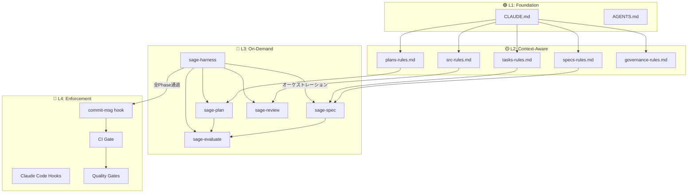

### 4層ガードレール構造

| 層 | 名前 | 役割 | いつ動くか |
|----|------|------|-----------|
| 🟢 **L1** | **Foundation** | CLAUDE.md / AGENTS.md。AIが最初に読む「憲法」 | **毎セッション自動** |
| 🟡 **L2** | **Context-Aware** | `.claude/rules/`。パス別の詳細ルール | **該当ファイル操作時のみ** |
| 🔵 **L3** | **On-Demand** | `.claude/skills/`。ワークフロー + 自動採点 + ハーネス | **`/sage-spec` `/sage-harness` 等で呼んだ時のみ** |
| 🔴 **L4** | **Enforcement** | Claude Code hooks + commit-msg hook + CI Gate + Quality Gates | **セッション中＋コミット・PR時に機械強制** |

---

## 開発ライフサイクル

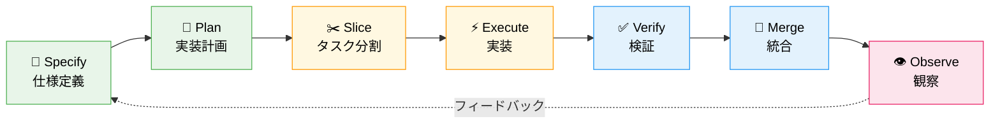

### 採点・修正ループ（Evaluator Read-Only + Creator Agent 修正）

`/sage-harness` がオーケストレーターとして、Evaluator（採点のみ）と Creator Agent（修正のみ）を分離制御する。**同一エージェントが採点と修正を兼務しない**。

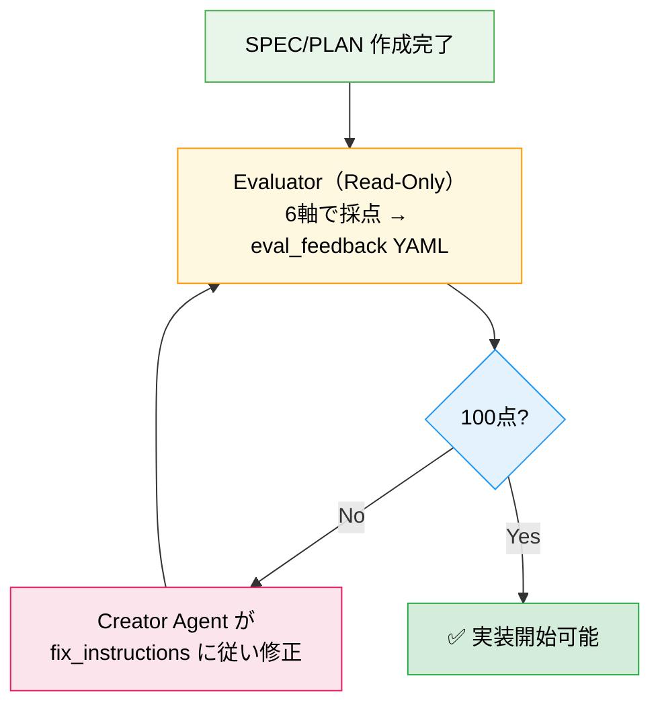

| 軸 | 満点 | 何を見るか |
|----|------|-----------|
| ① Codified Rules | **20点** | CLAUDE.md連携・Forbidden Shortcuts・機械的ゲート |
| ② Atomic Decomposition | **20点** | タスク独立性・依存グラフ・完了条件 |
| ③ Spec-Driven Development | **20点** | SPEC-ID・受け入れ条件・エラーケース |
| ④ Observable Development | **20点** | 検証コマンド・テスト種別・フィードバック |
| ⑤ Knowledge Management | **15点** | failures.md連携・Error Resolution |
| ⑥ 段階採用戦略 | **5点** | 影響ゼロ設計・ロールバック手順 |

| スコア | グレード | 判定 |
|--------|---------|------|
| **100** | 🏆 S++ | 完璧。即実装可 |
| 95-99 | ⭐ S+ | ほぼ完成。微修正で到達可能 |
| 90-94 | ✨ S | 優秀。小改善あり |
| 85-89 | 🔹 A- | 良好。改善推奨 |
| 70-84 | 🔸 B | 基本OK。要改善 |
| ~69 | ⚠️ C | 大幅改善必要 |

---

## 導入方法

> **⚠️ Trust First**: SAGE installer は約 364KB の large generated shell script (source は SPEC-0014 で `scripts/generator/` 7 module に分割済、配布は単一 file 維持) で、`.git/hooks` / `.github/workflows` / `.claude/settings.json` 等を一括書き換えます。**未検証で実行しないでください**。Phase 1 (SPEC-0010) で provenance 表示と dry-run プレビュー、Phase 6.1 ([SPEC-0018](specs/SPEC-0018-installer-supply-chain-hardening.md)) で **GitHub Releases primary distribution + SHA256SUMS 公開 + `--verify-checksum --remote`** を実装済 — 下記の推奨手順 (Step 1A) を使ってください。詳細は [SECURITY.md](SECURITY.md) を参照。

### Step 1A: 推奨手順 (download → verify checksum → preview → review → execute)

```bash
cd /path/to/your-project

# 1. Download install.sh + SHA256SUMS from GitHub Releases (primary, immutable per tag)
curl -fsSL -o install.sh    https://github.com/heidayo/sage-ai-template/releases/latest/download/install.sh
curl -fsSL -o SHA256SUMS    https://github.com/heidayo/sage-ai-template/releases/latest/download/SHA256SUMS

# 2. Verify SHA256 against the published SHA256SUMS (SPEC-0018)
shasum -a 256 -c SHA256SUMS    # macOS / BSD
# or: sha256sum -c SHA256SUMS   # Linux GNU coreutils

# 3. Verify provenance (SHA256 / 由来 / ライセンス確認)
bash install.sh --print-provenance

# 4. Preview without writing (dry-run で副作用なし内容確認)
bash install.sh --dry-run

# 5. (任意) install.sh 自体を読む / shellcheck で検査
less install.sh
shellcheck install.sh

# 6. Execute
bash install.sh

# 7. Post-install drift detection (任意・推奨)
bash install.sh --verify-checksum                # local state vs current files
bash install.sh --verify-checksum --remote       # local installer vs release SHA256SUMS (SPEC-0018)
```

### Step 1B: 一行導入 (隔離環境・dev container 等で sandbox 済の場合のみ)

> 上記 Step 1A の verify / preview / review を省略するため、**未検証 repository / 本番開発端末では非推奨** です。

```bash
cd /path/to/your-project
# Primary (GitHub Releases, immutable per tag, recommended for production):
curl -fsSL https://github.com/heidayo/sage-ai-template/releases/latest/download/install.sh | bash

# Legacy fallback (Gist, mutable, kept for backward compat with existing .sage/config.yaml users):
# curl -fsSL https://gist.githubusercontent.com/heidayo/98c36fbaf41cc5170b071b21bde3bb51/raw/install.sh | bash
```

または既に repository を clone 済の場合:

```bash
bash install.sh
```

### Step 2: 完了

これだけです。以下が自動セットアップされます：

```
your-project/
├── 🟢 CLAUDE.md              ← AI が毎セッション自動で読む
├── 🟢 AGENTS.md              ← Codex が自動で読む
├── 🟡 .claude/rules/         ← パス別ルール（5ファイル）
├── 🔵 .claude/skills/        ← ワークフロー（5スキル）
├── 📝 specs/                 ← SPEC テンプレート
├── 📐 plans/                 ← PLAN テンプレート
├── ✂️  tasks/                 ← TASK テンプレート
├── 📜 sage/                  ← ガバナンス文書
├── 📜 templates/hooks/     ← Claude Code hooks（5スクリプト）
├── 🔴 .git/hooks/commit-msg  ← TASK-ID 強制
├── ⚙️  .sage/install-state.yaml ← インストール状態記録
└── ⚙️  scripts/               ← ID生成・検証
```

### Step 3: 普通に開発を始める

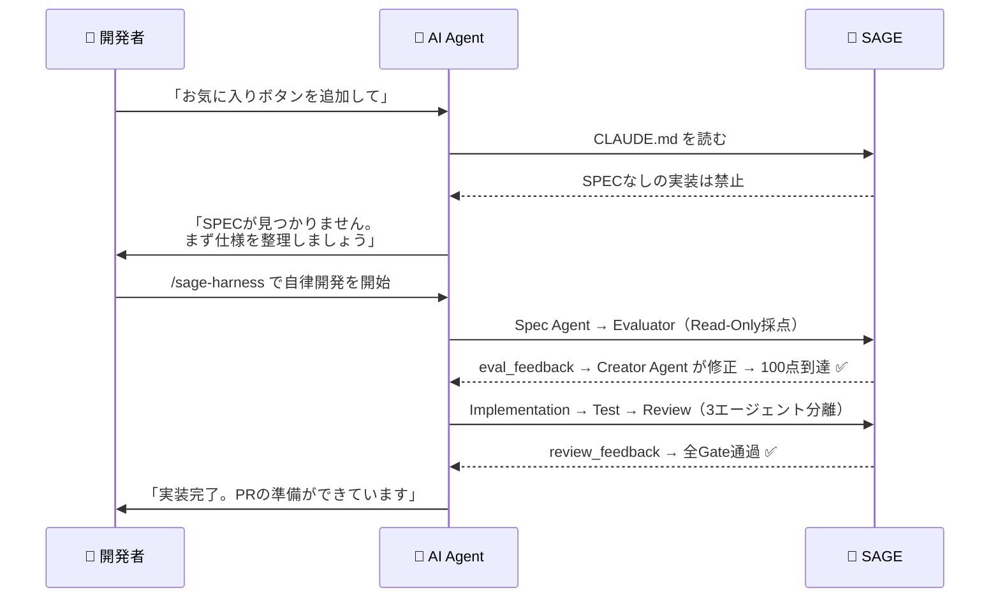

---

## AIエージェントでの運用

### セッション分離（必須）

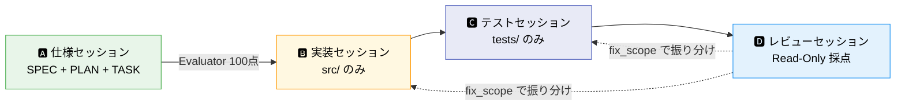

| セッション | 役割 | 使うスキル | Write権限 | 禁止事項 |
|-----------|------|-----------|----------|---------|
| 🅰️ **仕様** | SPEC・PLAN・TASKを作る | `/sage-spec` `/sage-plan` | specs/, plans/, tasks/ | コードを書かない |
| 🅱️ **実装** | TASKのFile Scopeに従って実装 | — | src/（File Scope内） | tests/, specs/ を触らない |
| 🅲️ **テスト** | テストを作成・修正 | — | tests/ | src/ を修正しない |
| 🅳️ **レビュー** | 6軸100点で採点 + Gate実行 | `/sage-review` | NONE | コードを一切修正しない |

> **鉄則**: 同じセッションで実装とレビューを行わない。`/sage-harness` はこの分離を自動で制御する

---

## 開発レーン（Lanes）

変更のリスクと規模に応じて4つのレーンを用意。ブランチ名で**自動判定**される。

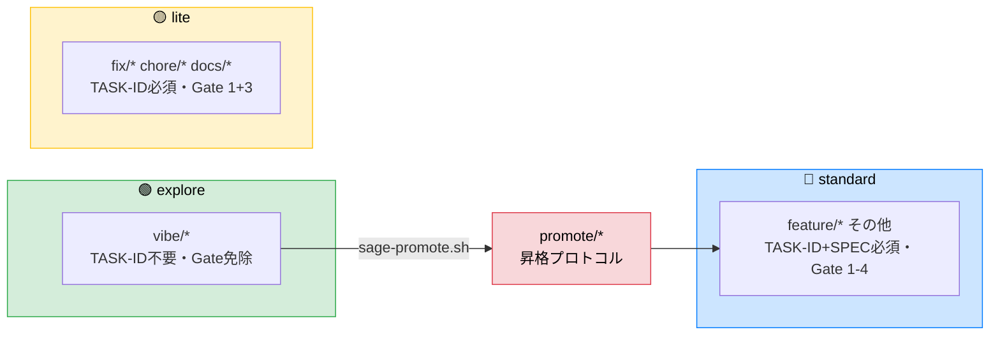

| レーン | ブランチ | TASK-ID | SPEC | 必須Gate | 用途 |
|-------|---------|---------|------|---------|------|
| 🟢 **explore** | `vibe/*` | 不要 | 不要 | なし | プロトタイプ・PoC・技術検証 |
| 🟡 **lite** | `fix/*` `chore/*` `docs/*` | 必須 | 不要 | Gate 1 + 3 | typo fix・依存更新・ドキュメント修正 |
| 🔵 **standard** | `feature/*` その他 | 必須 | 必須 | Gate 1-4 | 本番機能開発 |
| 🔴 **promotion** | `promote/*` | 必須 | Retro-SPEC | Gate 1-4 | explore 成果の昇格と本番統合前の管理 |

### 昇格プロトコル（explore → promotion → standard）

探索で得た成果を本番に持ち込むには、昇格プロトコルを通す。
操作環境に応じて3つの方法がある:

| 環境 | 操作方法 |
|------|---------|
| 🖥️ **ターミナル** | `bash scripts/sage-promote.sh vibe/my-feature` |
| 💬 **デスクトップアプリ** (Claude Code) | `/sage-promote` またはチャットで「本番に持っていきたい」 |
| 🌐 **ブラウザアプリ** (Claude Code) | `/sage-promote` またはチャットで「昇格して」 |

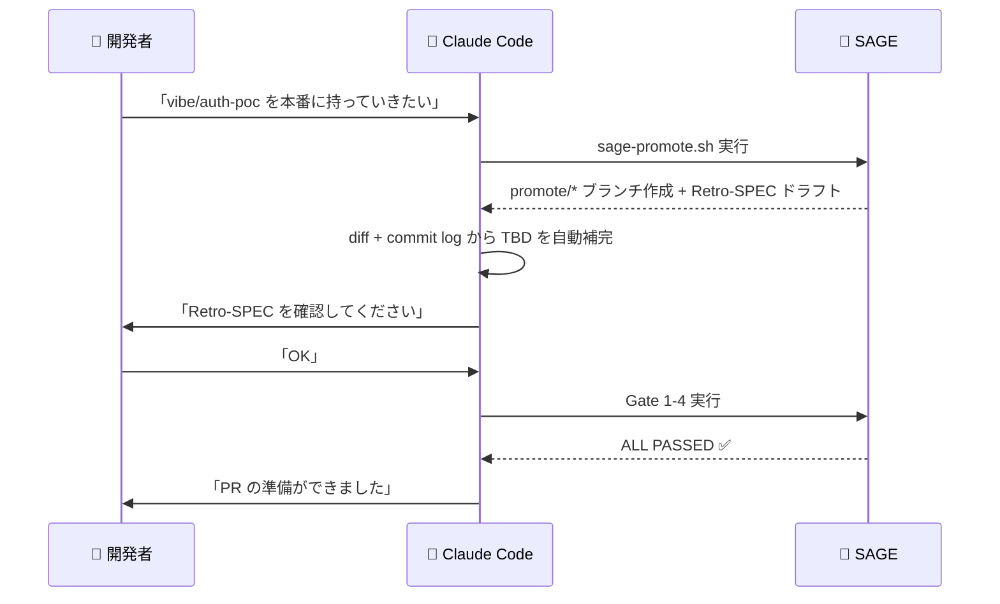

`vibe/*` → `main` への直接マージは禁止。必ず `promote/*` を経由する。

### セッション開始時の自動レーン通知

どの環境でも、セッション開始時に `session-start` hook が現在のレーンを自動表示する:

```
--- Current Lane ---
  Branch: vibe/auth-poc
  Lane:   🟢 explore
  Rules:  Free exploration. No SPEC, no TASK-ID, no gates required.
```

AIはこの情報を読み取り、レーンに応じた行動を自動で切り替える。

---

## 核心思想

| # | 原則 | 説明 |
|---|------|------|
| 1 | 📝 **仕様が最上位の真実** | コードは成果物であり、真実ではない |
| 2 | 🤖 **AIは制約内の実行者** | 仕様・役割・権限・制約・検証の中で働く |
| 3 | ✅ **品質は検証から生まれる** | モデルの優秀さではなく、構造と検証の強さ |
| 4 | ✂️ **並列化は分割設計** | AIを増やすのではなく、責務を分けて粒度を整える |
| 5 | 👤 **人間は監督者** | 目的定義・仕様承認・優先順位・例外判断・最終責任 |

---

## ディレクトリ構成

```
.
├── 🟢 CLAUDE.md                    # Claude Code 向けのブートストラップ
├── 🟢 AGENTS.md                    # Codex向けルール
│
├── 🟡 .claude/
│   ├── rules/                      # パス別ルール（自動ロード）
│   │   ├── specs-rules.md          # specs/** 操作時
│   │   ├── plans-rules.md          # plans/** 操作時
│   │   ├── tasks-rules.md          # tasks/** 操作時
│   │   ├── src-rules.md            # src/** app/** 操作時
│   │   └── sage-governance-rules.md # sage/** 操作時
│   │
│   └── skills/                     # オンデマンドワークフロー
│       ├── 🔵 sage-spec/           # /sage-spec → SPEC作成
│       ├── 🔵 sage-plan/           # /sage-plan → PLAN+TASK作成
│       ├── 🔵 sage-review/         # /sage-review → コードレビュー（6軸100点）
│       │   └── references/         # コードレビュー採点基準
│       ├── 🔵 sage-evaluate/       # /sage-evaluate → SPEC/PLAN採点（Read-Only）
│       │   └── references/         # SPEC/PLAN採点基準・知識ベース
│       └── 🔵 sage-harness/        # /sage-harness → 自律開発オーケストレーター
│
├── 📜 templates/                    # テンプレート・フック
│   └── 📜 hooks/                   # Claude Code hooks（5スクリプト）
│
├── 📝 specs/                       # SPEC-XXXX 仕様書
├── 📐 plans/                       # PLAN-XXXX 実装計画
├── ✂️  tasks/                       # TASK-XXXX タスク定義
├── 📜 sage/                        # ガバナンス文書（人間の承認が必要）
├── ⚙️  scripts/                     # ID生成・検証・公開スクリプト
│   ├── sage-doctor.sh              # SAGE健全性チェック
│   ├── sage-repair.sh              # ファイル修復
│   └── sage-report.sh              # 採用メトリクス
├── 🔴 .git/hooks/                  # commit-msg hook（TASK-ID強制）
├── 🔧 .sage/                       # ランタイム設定・実行ログ
│   ├── install-state.yaml          # インストール状態記録
│   └── metrics/                    # 採用メトリクスデータ
└── 🔴 .github/                     # CI/CDワークフロー
```

---

## カスタマイズと更新の共存

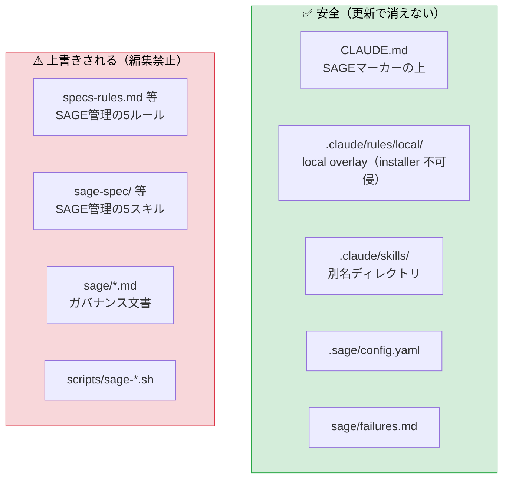

| やりたいこと | やり方 | 更新時 |
|:------------|:-------|:------:|
| プロジェクト固有ルールを追加 | `.claude/rules/local/` に配置（下記 local overlay 参照） | ✅ 安全 |
| プロジェクト全体の指示を追加 | CLAUDE.md のSAGEマーカーより**上**に書く | ✅ 安全 |
| スキルを追加 | `.claude/skills/` に**別名で**ディレクトリ作成 | ✅ 安全 |
| SAGE管理ファイルを直接編集 | **やらない** | ❌ 消える |

### local overlay（`.claude/rules/local/` / `.codex/rules/local/`）

SPEC-0025 で定義された installer **絶対不可侵**のカスタマイズ層です。installer は `.claude/rules/local/` と `.codex/rules/local/` 配下のファイル・ディレクトリを**作成・上書き・削除しません**（installer 自身がディレクトリを作ることもありません — 必要になったら自分で作成してください）。

| プロジェクト固有ルールの置き方 | `bash install.sh` 更新時 |
|:------------------------------|:------------------------|
| managed ファイル（`.claude/rules/specs-rules.md` 等）に直接追記 | ❌ 全置換され**消える** |
| `.claude/rules/local/` にファイルを配置 | ✅ **保持される** |

```bash
mkdir -p .claude/rules/local
echo "# My project rules" > .claude/rules/local/my-rules.md
bash install.sh   # 何度更新しても local/ は不変
```

Codex 向けの managed ルール層 `.codex/rules/`（SPEC-0029）も同じ方式で配布されます。優先順位（`.codex/rules/` > ルート `AGENTS.md`）・読み込み手順・`.claude/rules/` との対応表は [docs/codex-rules.md](docs/codex-rules.md) を参照してください。

**レビュー責任について（セキュリティ境界）**: overlay は `.sage/install-state.yaml` の checksum 管理外です。つまりテンプレート供給元から改変されない領域である一方、`install.sh --verify-checksum` の検証対象にもなりません。`local/` 配下の内容は**導入プロジェクト自身のレビュー責任**です。

**テンプレート更新時の checksum 変化について**: テンプレート更新（例: managed rules への注記追加）で managed ファイルの checksum が変わると、更新前の install-state に対して `--verify-checksum` が一時的に FAIL に見えることがあります。これは通常のテンプレート更新と同じ扱いで、`bash install.sh` 実行による install-state 再生成で解消されます。

### ID 受理パターンのカスタマイズ（SPEC-0027）

`TASK-hei-a7f3` のような作業者プレフィックス形式の ID を併用したい場合、`.sage/id-patterns.json` で受理パターンを拡張できます（受理のみ。生成はデフォルト形式のまま）。installer は既存の `.sage/id-patterns.json` を上書きしません（preserve-if-exists）。書式・設定例・注意点は [docs/id-patterns.md](docs/id-patterns.md) を参照してください。

### project_checks スタックプリセット（SPEC-0028）

新規導入時に `bash install.sh --stack go|ts-pnpm|node-npm|python` で `.sage/config.yaml` の `project_checks` を標準コマンドで初期化できます。`--stack` 未指定時はマーカーファイル（`go.mod` / `pnpm-lock.yaml` 等）から自動検出します（優先順位: go > ts-pnpm > node-npm > python）。既存の `.sage/config.yaml` は変更しません（preserve-if-exists）。プリセットの実体は `templates/project-checks/` 配下です。詳細は [docs/stack-presets.md](docs/stack-presets.md) を参照してください。

### TypeScript enforcement（SPEC-0030）

TypeScript プロジェクト向けに、tsc エラー数ラチェット（`scripts/sage-tsc-ratchet.sh`）と型抑制コメント・`any` を error 化する ESLint 断片（`templates/ts-enforcement/`）を opt-in で提供します。installer 非配布（ファイルコピー導入）です。導入手順・運用規約は [docs/ts-enforcement.md](docs/ts-enforcement.md) を参照してください。

### 更新前バックアップと復元（SPEC-0026）

installer は更新時、内容が変わる既存ファイルを書き込み前に `.sage/backup/<timestamp>/`（直近3世代）へ自動バックアップします。更新前の差分確認は `bash install.sh --diff`、復元は `cp .sage/backup/<最新timestamp>/<ファイル> <ファイル>` です。マーカー方式で防御される / 防御されないケースの対比表を含む詳細は [docs/installer-preservation.md](docs/installer-preservation.md) を参照してください。

---

## 更新方法

### 更新通知（推奨）

`.sage/config.yaml` に `installer_url` を設定するだけ。SPEC-0018 以降は GitHub Releases URL を推奨 (immutable per tag、SHA256SUMS で verification 可)：

```yaml
auto_update:
  # Primary (recommended for production, SPEC-0018):
  installer_url: "https://github.com/heidayo/sage-ai-template/releases/latest/download/install.sh"
  # Tag-pinned for full reproducibility (auto-update notification は skip される):
  # installer_url: "https://github.com/heidayo/sage-ai-template/releases/download/v1.6.0/install.sh"
  # Legacy fallback (Gist):
  # installer_url: "https://gist.githubusercontent.com/heidayo/98c36fbaf41cc5170b071b21bde3bb51/raw/install.sh"
```

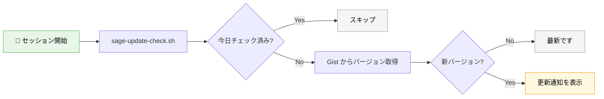

新バージョンが見つかった場合も、このスクリプトは remote installer を自動実行しません。通知を見てから、手動で更新します。

### 手動更新

```bash
bash install.sh
```

---

## 既存 CLAUDE.md がある場合

初回導入時に既存ルールを自動監査します。

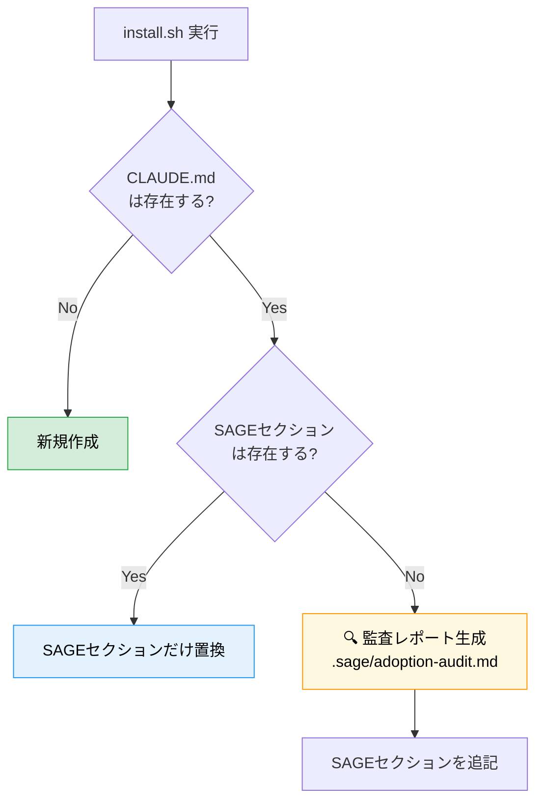

### 監査レポートの3区分

| 区分 | 意味 | 対応 |
|:-----|:-----|:-----|
| ✅ **SAFE_AUTO_APPLY** | SAGEと無関係 | 何もしなくてOK |
| 🟡 **NEEDS_REVIEW** | SAGEと重複の可能性 | 手動で確認、重複を削除 |
| 🔴 **CONFLICT** | SAGEと矛盾の可能性 | **手動で解決が必要** |

---

## 導入フェーズ

`install.sh` は Phase A を自動セットアップします。

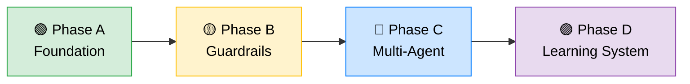

| Phase | 内容 | 状態 |
|-------|------|:----:|
| 🟢 **A: Foundation** | 仕様テンプレ・タスクテンプレ・基本CI・境界定義 | ✅ 自動 |
| 🟡 **B: Guardrails** | architecture check・security scan・レビュールール・hooks profile設定 | 📋 手動 |
| 🔵 **C: Multi-Agent** | 実装/テスト/レビューAI 3分離・`/sage-harness` 自律ループ・doctor/repair/report | 📋 手動 |
| 🟣 **D: Learning System** | 実行履歴分析・失敗パターン蓄積・テンプレ改善 | 📋 手動 |

詳細は [sage/adoption-phases.md](sage/adoption-phases.md) を参照。

---

## よく使うコマンド

```bash
# SPEC-ID を発行
bash scripts/sage-id-gen.sh spec

# PLAN-ID を発行
bash scripts/sage-id-gen.sh plan

# TASK-ID を発行
bash scripts/sage-id-gen.sh task

# 構造検証
bash scripts/sage-validate.sh

# SAGE健全性チェック
bash scripts/sage-doctor.sh

# ファイル修復
bash scripts/sage-repair.sh

# 採用メトリクス
bash scripts/sage-report.sh

# vibe/* ブランチを本番用に昇格
bash scripts/sage-promote.sh vibe/my-feature

# Retro-SPEC ドラフト生成（昇格時に自動実行される）
bash scripts/sage-retro-spec.sh
```

---

## ライセンス

SAGE Development System は **Apache License, Version 2.0** で配布されます。
詳細は [LICENSE](LICENSE) を参照してください。

```
Copyright 2026 heidayo and SAGE Development System contributors

Licensed under the Apache License, Version 2.0 (the "License");
you may not use this file except in compliance with the License.
You may obtain a copy of the License at

    http://www.apache.org/licenses/LICENSE-2.0
```

### 帰属表示・統合知識源

SAGE は単独著作物ですが、設計思想・ベストプラクティスの統合源があります:

- 設計インスピレーション (5 source) は [ATTRIBUTION.md](ATTRIBUTION.md) に列挙
- v2 改修にあたり参照した一次ソース (OWASP / NVD CVE / Anthropic 公式 / OpenAI 公式 / Check Point 等 65 資料) も同 [ATTRIBUTION.md](ATTRIBUTION.md) に整理

### Contribution

contribution 受付方針は [CONTRIBUTING.md](CONTRIBUTING.md)、脆弱性報告は [SECURITY.md](SECURITY.md) を参照してください。

### Codex 利用者向け

Codex (CLI / Cloud / codex-action) を SAGE と組み合わせて使う場合は [docs/codex-security.md](docs/codex-security.md) を参照してください (Phase 3 / SPEC-0013): config.toml 推奨設定 / Codex Cloud / CODEX_HOME 対策 / codex-action hardening / IR 手順。
